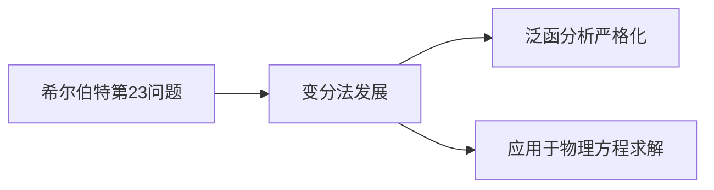

英语：varational是个名词

回顾一下数据同化的历程。
逐步订正，松弛逼近。这两个都没有考虑误差。
Kalman滤波。考虑了背景误差和观测误差。

变分是另一种方式。最早不是做同化的用的，而是1958年的苏联人弄核物理的时候提了一嘴。美国后来冷战基金把俄文翻译成英文，发现了这个历史。

数据同化的目的：  
利用所有可用的信息，尽可能准确地确定大气流动的状态。

>早期的客观分析和数据同化方法: 
>Panofsky(1949)：提出的2维全局多项式插值方法是第一个客观分析方法；
>
>Gilchrist and Cressman(1954)：提出局地多项式插值方法；
>
>Bergthorsson and Doos(1955)：指出客观分析中应该给出所有格点的初猜值来弥补观测的不足，由此发展了逐步订正法（Cressman 1959, Barnes 1964,1978）。逐步订正法采用了短期预报的结果作为初猜值，又不断插入观测（6 h/次），这样的循环过程就构成四维数据同化；
>
>Gandin(1963)：提出最优插值方法；
>
>Sasaki(1970)：首先将变分法引入初始化过程；
>
>Hoke and Anthes(1976)：提出Nudging（牛顿张弛）四维数据同化方法。
>
>Lewis and Derber(1985), LeDimet and Talagrand(1986),Courtier and Talagrand(1987) 提出了四维变分同化方法(4DVAR), 随后ECMWF和NMC相继在业务上采用三维和四维变分同化方法。

### 变分法的历史发展

#### 1. 起源：最速降线问题（1696）
- **核心事件**：约翰·伯努利（Johann Bernoulli）公开提出"最速降线问题"，挑战数学界寻找两点间耗时最短的下降曲线。
- **解决方案**：
  - 牛顿、莱布尼茨、雅可比·伯努利等给出特解
  - **里程碑意义**：首次揭示特定函数极值问题需用新数学工具

#### 2. 理论奠基：欧拉-拉格朗日方程（1744-1755）
| 时间   | 人物                          | 贡献                             |
| ---- | --------------------------- | ------------------------------ |
| 1744 | 欧拉（Leonhard Euler）          | 出版《寻求极大或极小性质的曲线的技巧》，建立变分法基本方程  |
| 1755 | 拉格朗日（Joseph-Louis Lagrange） | 提出**广义变分法理论**，推导出**欧拉-拉格朗日方程** |

> **学科标志**：此阶段正式确立变分法（Calculus of Variations）为数学独立分支

#### 3. 希尔伯特问题中的定位（1900）
- **关键事件**：希尔伯特（David Hilbert）在巴黎国际数学家大会提出23个数学问题
- **问题23**：发展变分学方法的研究

同化的目的，需要得到一个场，误差场的方差最小。
最降速曲线，需要得到一个曲线，曲线的路径时间最短。

**​泛函概念说明​**​

简单的讲，自变量为函数的函数称作泛函。譬如，一函数 y=f(x)，如果另一函数 v=v(y) 的自变量为前一函数 y=f(x)，则有 v=v(f(x))。我们称函数 v=v(y) 为 y 的泛函。

​**​泛函与复合函数的区别​**​  
以 $z=y^2$ 和 $y=sin(x)$ 为例：
1. 若构造复合函数 $z=sin^{2}(x)$，给定一个 $x$ 值即可得到 $z$ 值；
2. 若将 $z=y^{2}$ 视为自变量为$sin(x)$的泛函，则其自变量是整个函数 $sin(x)$ —— 为求一个 $z$ 值，必须知道整个曲线 $sin(x)$ 的值。

欧拉方法
巴拉巴拉

### 同化方式小结
模式的结果使得同化受到了一定的约束。在逐步订正的时候，观测不会受到约束条件，在松弛逼近和卡尔曼、变分却有。
如果观测很多，可以用函数拟合。
有观测和背景场。
$x=x_{background}+\omega(x_{obs}-x)$
在逐步订正中，$\omega$是人为指定的，而Kalman滤波中，$\omega$是Kalman滤波的K，需要随着观测而更新。
松弛逼近的话，是在控制方程中后面加上了一个松弛项，松弛项的形式也是$\omega(x_{obs}-x)$，但是$\omega$量级要小。

### 三维变分（3DVAR）
如果已知大气的观测$y_{0}$，背景场$x_{b}$，那么按照线性估计理论，在统计意义下$x$的最佳估计（分析场）是
$$
x=x_{b}+[B^{-1}+H^TO^{-1}H]^{-1}H^TO^{-1}(y_{0}-Hx_{b})
$$
他是下面目标函数的极小值点
$$
J(x)=\frac{1}{2}[(x-x_{b})^TB^{-1}(x-x_{b})+(H(x)-y_{obs})^TO^{-1}(H(x)-y_{obs})]
$$

三维变分，没有流依赖。